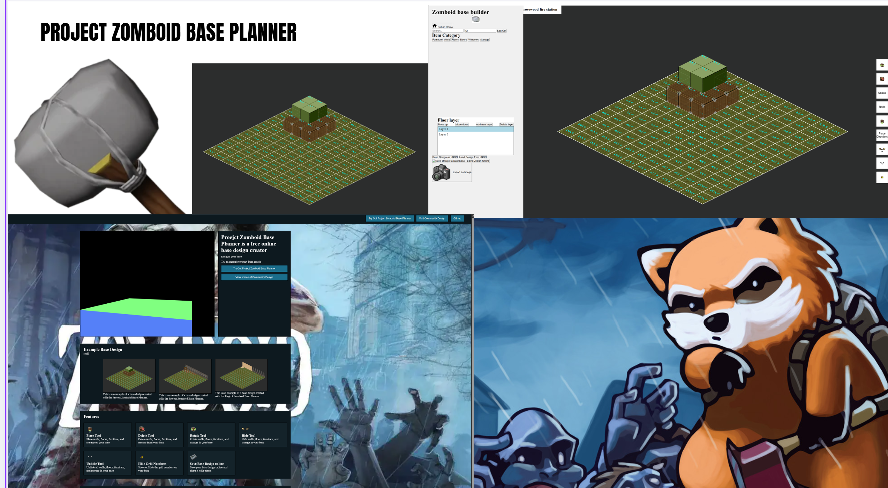
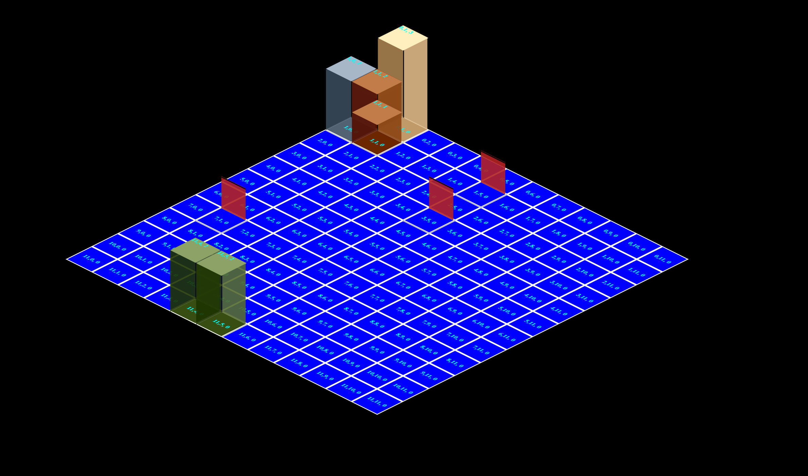
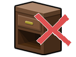
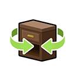
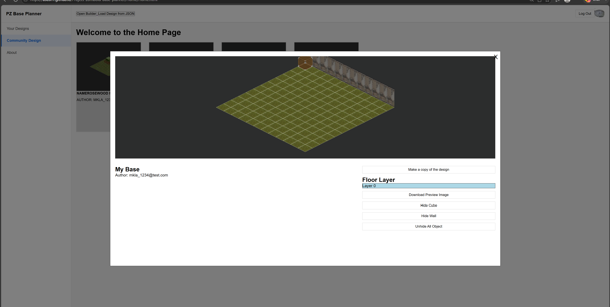
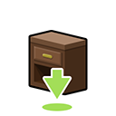
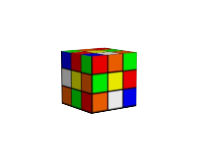

<a id="readme-top"></a>

<br/>
<div align="center">
    
    <h3 align="center">Project Zomboid Base Planner</h3>
    <p align="center">
        This is a fan-made, web-based base creator to create the blueprint of your future base
        <br/>
        <a href="https://asusn1.github.io/Project-zomboid-base-planner/"><strong>Try it out</strong></a>
        <br/>
        ·
        <a href="https://github.com/ASusN1/Project-zomboid-base-planner/issues">Report Bug</a>
        ·
        <a href="https://github.com/ASusN1/Project-zomboid-base-planner/issues">Request Feature</a>
    </p>
</div>

<details>
    <summary>Table of Contents</summary>
    <ol>
        <li>
            <a href="#about-the-project">About The Project</a>
        </li>
        <li>
            <a href="#for-users">For Users</a>
            <ul>
                <li><a href="#try-it-out">Try it Out</a></li>
                <li><a href="#how-to-use-it">How to use it</a></li>
                <li><a href="#features">Features</a></li>
                <li><a href="#screenshots">Screenshots</a></li>
            </ul>
        </li>
        <li>
            <a href="#for-developers">For Developers</a>
            <ul>
                <li><a href="#built-using">Built Using</a></li>
                <li><a href="#installation">Installation</a></li>
            </ul>
        </li>
        <li><a href="#fan-content-disclaimer">Fan Content Disclaimer</a></li>
    </ol>
</details>

## About The Project
<br/>

Project Zomboid Base Planner is a web-based version of Project Zomboid's building/construction system. The goal of this project is to let players prebuild their base beforehand and calculate the material cost (such as plank or steel metal, etc).

<video src="feature_video/test.mp4" controls width="100%"></video>
<p align="center"><em>(Full walkthrough video)</em></p>

<p align="right">(<a href="#readme-top">top</a>)</p>

---

# For Users

This section is a guide for anyone who just wants to use Project Zomboid Base Planner.

## Try it Out

**[Visit the Live Site](https://asusn1.github.io/Project-zomboid-base-planner/)**

<p align="right">(<a href="#readme-top">top</a>)</p>

## How to use it

1. Upon first opening Project Zomboid Base Planner, you will land at the landing page. This is just an intro page about the app and what it does. You can create your own design by clicking the "Try base design" button, or view other players' designs at "View community design."

   

2. Upon opening the base builder, you will see the base creator. To actually build your own base, make sure the "Place Tool" is selected (shortcut is `P`) — it is on by default. Select an object from any of the item categories, then hover over the isometric grid and start placing objects.
- **Delete:** Hover over the object you want to delete, then click on it (shortcut is `D`)
   
   - **Hide:** Press the hide object button, or shortcut `H`.
   
   - **Unhide All:** Press `Alt + H`.
   
   - **Rotate:** Press the rotate button, then hover over the object you want to rotate — it will rotate 90 degrees clockwise each time.
   
   - **Switch Floor:** Use the floor layer panel to add, delete, or switch between multiple floors.
   
   - **Capture Design:** Press the "capture base design as picture" button (camera icon). This will ask you to allow permission to share your screen for the download to work.
   
   - **Save Online:** You need to create an account or sign in with an existing account. If it's your first time, use the Sign Up button this will show a modal walking you through account creation.
    
   - **Share Online:** Requires an account. Press "Share to Community" to share your design with other people.
   
   - **Preview Community Designs:** Press "Community Design" and click on an item card. This shows a modal preview of that design, where you can hide and unhide objects but cannot edit it.
   

<p align="right">(<a href="#readme-top">top</a>)</p>

## Features

| Feature | Icon | Description |
|---|---|---|
| Place Tool |  | Place walls, floors, furniture, and storage on your base |
| Delete Tool |  | Delete walls, floors, furniture, and storage from your base |
| Rotate Tool |  | Rotate walls, furniture, and storage in your base |
| Hide Tool |  | Hide individual objects without deleting them |
| Unhide Tool |  | Bring back every object that was hidden |
| Hide Grid Numbers |  | Show or hide the coordinate numbers printed on each tile |
| Save Design Online |  | Save your design to your account so it can be loaded later or shared |
| Export as Image |  | Capture and download your base design as a PNG |

Other features:
- Multiple floor layers with add / delete / reorder / switch support
- Multi-tile object placement with collision checks so objects can't overlap
- Undo / redo on tile, wall, and cube placement
- Save and load designs as JSON files
- Account system (sign up, log in, log out, and password reset)
- Community page to browse, preview, and copy designs shared by other users
- Searchable, categorized item sidebar

<p align="right">(<a href="#readme-top">top</a>)</p>

## Screenshots

**Landing Page**


**Base Builder**


**Home Page - Your Designs**


**Home Page - Community Designs**


<p align="right">(<a href="#readme-top">top</a>)</p>

---

# For Developers

This is the part for whoever wants to contribute to this project.

## Built Using

* JavaScript (vanilla, no framework) - Grid editor and UI logic
* HTML5 / CSS3 - Structure and isometric 3D transforms
* [Node.js](https://nodejs.org/) / [Express](https://expressjs.com/) - Backend API
* [Supabase](https://supabase.com/) - Auth, database, and storage
* [Vercel](https://vercel.com/) - Backend hosting
* [GitHub Pages](https://pages.github.com/) - Frontend hosting
* [Three.js](https://threejs.org/) - 3D model viewer on the landing page

<p align="right">(<a href="#readme-top">top</a>)</p>

## Installation
## Built Using

* JavaScript (vanilla, no framework) - Grid editor and UI logic
* HTML5 / CSS3 - Structure and isometric 3D transforms
* [Node.js](https://nodejs.org/) / [Express](https://expressjs.com/) - Backend API
* [Supabase](https://supabase.com/) - Auth, database, and storage
* [Vercel](https://vercel.com/) - Backend hosting
* [GitHub Pages](https://pages.github.com/) - Frontend hosting
* [Three.js](https://threejs.org/) - 3D model viewer on the landing page

<p align="right">(<a href="#readme-top">top</a>)</p>

## Installation

**Prerequisites:**
- Node.js v18 or higher
- npm (comes with Node.js)
- Python 3.x (only needed to serve the frontend locally)
- A free [Supabase](https://supabase.com/) project (for your own database/auth during development)

**Backend dependencies** (installed automatically via `npm install`, listed here for reference):

| Package | Purpose |
|---|---|
| `express` | Web server / API routing |
| `@supabase/supabase-js` | Supabase client for auth, database, and storage |
| `cors` | Allows the frontend origin to call the backend |
| `dotenv` | Loads environment variables from `.env` |
| `multer` | Handles preview image uploads |
| `express-rate-limit` | Rate limits incoming requests |

**Run the front end**

1. Clone the repository
```sh
   git clone https://github.com/ASusN1/Project-zomboid-base-planner.git
   cd Project-zomboid-base-planner
```
2. Run a local server from the project root
```sh
   python -m http.server 8000
```
3. Open your browser and go to
```
   http://localhost:8000
```
Always use `http://`, not `file://` — Supabase calls and `fetch()` will not work otherwise.

**Running the backend:**

1. Go into the backend folder
```sh
   cd back_end_stuff
```
2. Install dependencies
```sh
   npm install
```
3. Create a `.env` file in `back_end_stuff/` with your own Supabase keys

| Variable | Description |
|---|---|
| `SUPABASE_URL` | Your Supabase project URL |
| `SUPABASE_ANON_KEY` | Your Supabase anon/public API key |
| `FRONTEND_ORIGIN` | The origin allowed to call the backend (e.g. `http://localhost:8000`) |

```
   SUPABASE_URL=your_supabase_project_url
   SUPABASE_ANON_KEY=your_supabase_anon_key
   FRONTEND_ORIGIN=http://localhost:8000
```
4. Start the server
```sh
   node server.js
```
5. Confirm it's running by opening `http://localhost:3000` in your browser — you should see `PZ base planner running`.

**Running both together:** keep two terminals open — one serving the frontend on port 8000, one running the backend on port 3000. The frontend's `backend_config.js` should point at `http://localhost:3000` for local development.

<p align="right">(<a href="#readme-top">top</a>)</p>

---

## Fan Content Disclaimer

Thanks to The Indie Stone for creating [Project Zomboid](https://projectzomboid.com/), which made this possible. This is an unofficial fan production for non-commercial purposes made under [the Indie Stone Terms](https://projectzomboid.com/blog/support/terms-conditions/).

<p align="right">(<a href="#readme-top">top</a>)</p>